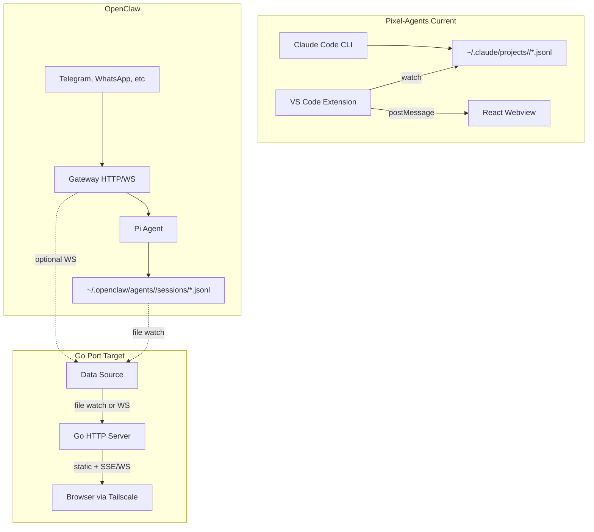
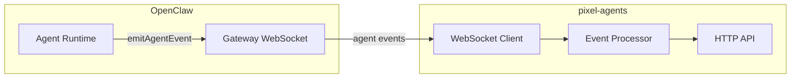

# Go Port of Pixel-Agents for OpenClaw

## Executive Summary

Unify **pixel-agents** (Claude Code office visualization) with **OpenClaw** by building a Go standalone app that:

- Consumes OpenClaw session data (JSONL files + optional WebSocket API)
- Maps OpenClaw's agent/session/subagent model to pixel office characters
- Enables agents to define their "home" layout via a new tool
- Integrates with OpenClaw channels and rich session APIs

---

## Architecture Comparison




---

## Key Unification Challenges

### 1. Transcript Format Mismatch


| Aspect      | Pixel-Agents (Claude Code)                 | OpenClaw (Pi)                                                                             |
| ----------- | ------------------------------------------ | ----------------------------------------------------------------------------------------- |
| Top-level   | `type: "assistant"` / `"user"`             | `type: "message"` with `message.role`                                                     |
| Tool blocks | `content[].type === "tool_use"`            | `toolCall` (id, name, arguments) or `tool_use` (id, name, input); `thinking` blocks       |
| Tool result | `role: "user"` + `tool_result` blocks      | `role: "toolResult"` + `toolCallId`, `toolName`, `content`; optional `details`, `isError` |
| Turn end    | `system` + `subtype: "turn_duration"`      | `stopReason` "stop"                                                                       |
| Subagent    | `progress` + `data.type: "agent_progress"` | Sessions-spawn → separate session file; `agent:*:subagent:*` keys in sessions.json        |


**Solution**: Implement the parser with **OpenClaw session and API format as first-class citizen**. Parse Pi JSONL natively. **Canonical format** (see `tool-usage-example.json`):

- **Tool call**: `type: "message"`, `message.role: "assistant"`, `message.content` array with `type: "thinking"` (skip for tool parsing) and `type: "toolCall"` blocks (`id`, `name`, `arguments`). `message.stopReason: "toolUse"`. Pi also uses `tool_use`/`input` and `toolCall`/`arguments` — parser must handle both.
- **Tool result**: `message.role: "toolResult"`, `message.toolCallId`, `message.toolName`, `message.content` (array of `type: "text"`), optional `message.details`, `message.isError`.
- **Turn end**: `stopReason` "stop"|"end_turn"|"toolUse" on assistant messages.

No Claude-format adapter layer; the parser is designed for OpenClaw/Pi from the ground up.

### 2. Session Model Mapping


| Pixel-Agents                     | OpenClaw                                                 |
| -------------------------------- | -------------------------------------------------------- |
| 1 terminal = 1 agent = 1 session | 1 agent = many sessions (sessions.json keys)             |
| Agent = character                | Agent = character; sessions = which one is "active"      |
| Subagent = Task tool spawn       | Subagent = sessions.spawn → `agent:main:subagent:taskId` |


**Solution**:

- **Character** = OpenClaw agent (from `agents.list` or config)
- **Active session** = per-agent: either "focused" session key or most recently updated
- **Subagent** = session key matching `agent:*:subagent:`* (e.g. `agent:nexus:subagent:dc101c87-8f60-4405-b4cc-fb0a2e149340`) → negative ID, parent linkage. In `sessions.json`, subagent entries are first-class keys with `sessionId`, `updatedAt`, and optionally `sessionFile`; each has its own transcript file. Parent linkage is implicit from the session key (agent id + `subagent:` + task UUID).
- Support multiple sessions per agent: show one "active" character per agent; allow switching which session drives the character's activity

### 3. Data Source Strategy (Resolved)

**One event stream, two possible sources.** The processor consumes a single event format (tool start, tool done, session activity). Events can come from either source — not both at once for the same session.


| Source                  | How it works                                                                                                                                                            | When used                                                              |
| ----------------------- | ----------------------------------------------------------------------------------------------------------------------------------------------------------------------- | ---------------------------------------------------------------------- |
| **Gateway WebSocket**   | Connect as client; receive `agent` events (tool start/end, lifecycle). **No transcript parsing.** Map `stream`, `data.phase`, `data.name` directly to processor events. | Primary when `OPENCLAW_GATEWAY_WS_URL` is set and connection succeeds. |
| **File watch + parser** | Watch `~/.openclaw/agents/*/sessions/*.jsonl`; on change, read new lines, **parse JSONL** (tool_use, tool_result, stopReason); emit same processor events.              | Fallback when gateway is unset, unreachable, or disconnected.          |


**Decision**: Prefer gateway when available (real-time, no file I/O). Fall back to transcript parsing when gateway is unavailable. The parser is **only needed for the fallback path** — when using the gateway, we never parse transcripts.

**Summary**:

- **Gateway**: Watch agent events → map to processor. No parsing.
- **File watch**: Watch JSONL → parse transcripts → map to processor.
- **Processor**: Same input either way. One source active at a time.

### 4. Agent-Defined Layout

See [Layout Autonomy Vision](#layout-autonomy-vision) below for full scope.

---

## Implementation Plan

### Phase 1: Go Host + Fallback Path (File Watch + Parser)

**Location**: New folder `openclaw-pixel-agents` (sibling to openclaw-fork, e.g. `d:\Git\openclaw-pixel-agents`).

**Greenfield**: Ignore any existing code in the folder. Build from scratch. Keep `tool-usage-example.json` and `sessions.json` as **real JSON fixtures** for parser and session tests.

Build the **fallback** data source first so pixel-agents works without a gateway (standalone, same machine as OpenClaw state).

1. **Go project setup**
  - `go.mod`, structure: `cmd/openclaw-pixel-agents/`, `internal/`
  - Dependencies: `fsnotify`, `encoding/json`; `net/http` (stdlib) for serving — no webview/Wails
  - **Linting**: `golangci-lint` and `deadcode` — CI must pass both; add `.golangci.yml` if needed
2. **Session path resolution**
  - Use `OPENCLAW_STATE_DIR` or `~/.openclaw`
  - Path: `{stateDir}/agents/{agentId}/sessions/`
  - List agents: read `agents/` dir or `openclaw.json` `agents.list`
  - List sessions: read `sessions.json` per agent, or scan `*.jsonl` in sessions dir
3. **Transcript watcher** (fallback path only)
  - Watch `{stateDir}/agents/*/sessions/*.jsonl` (fsnotify + polling fallback on Windows)
  - On change: read new lines, parse JSONL, dispatch to processor
4. **Parser (OpenClaw-first)** — used only when file watch is active
  - Parse Pi format natively: `type: "message"`, `message.role`, `message.content`. Reference: `tool-usage-example.json`.
  - Tool blocks: `toolCall` (id, name, arguments) — canonical; also `tool_use` (id, name, input), `toolUse`, `tool_call`.
  - Tool results: `role: "toolResult"` with `toolCallId`, `toolName`, `content`; optional `details`, `isError`.
  - Skip `type: "thinking"` blocks when extracting tool calls.
  - Turn end: `stopReason` "stop"|"end_turn"|"toolUse" on assistant messages; text-idle timer (5s) fallback for text-only turns.
5. **Processor** — single event interface (tool start, tool done, session activity). Consumes events from either source.
6. **HTTP server**: Serve static React build; optional WebSocket/SSE for live events. See [Deployment Model](#deployment-model).
7. **Agent/session mapping**
  - Load `sessions.json` per agent to get session keys and `sessionFile`
  - Resolve "active" session: most recent `updatedAt` or explicit user selection
  - Map session key to character ID; subagent keys → negative IDs

### Phase 2: Primary Path (Gateway WebSocket)

Add the **primary** data source when gateway is available. Use it instead of file watch; no transcript parsing.

1. **Gateway WebSocket client**
  - Connect to `OPENCLAW_GATEWAY_WS_URL` (e.g. `ws://openclaw:18789`)
  - Handshake: `connect` with `role: "operator"`, `scopes: ["operator.read"]`, `auth: { token }`
  - Listen for `event` frames with `event: "agent"`; map payload to processor events
2. **Source selection**
  - If gateway URL set and connection succeeds → use gateway; **stop file watch** for active sessions
  - If gateway unset or connection fails → use file watch + parser
  - On disconnect → fall back to file watch
3. **Optional**: `sessions.list`, `sessions.preview` for session metadata on startup
4. **Channels awareness**
  - Session `origin.channel`, `lastChannel` indicate channel source
  - Display channel badge on character (e.g. "Telegram", "webchat")
  - Optional: show incoming channel activity as character "notification"
5. **Launch flow**
  - No "claude --session-id" — sessions come from OpenClaw
  - "+ Agent" could: create new session via `sessions.reset` or gateway, or open webchat
  - "Focus" = select which session drives the character

### Phase 3: Agent-Defined Layout

Implement the [Agent Interface](#agent-interface-openclaw-tools-design) tools:

1. **OpenClaw extension**: `pixel_space.`* and `pixel_asset.`* tools (see tool set above)
2. **Backend**: Layout/asset dirs + ownership map; starter cell assignment; expansion and negotiation logic
3. **Co-existence**: Enforce ownership rules, conflict resolution, shared regions

### OpenClaw Extension: pixel-space

**Location**: `openclaw-fork/extensions/pixel-space/` (new extension in the OpenClaw repo).

**Purpose**: Register tools that agents call; each tool forwards requests to the sidecar API (`OPENCLAW_PIXEL_AGENTS_URL` or `http://pixel-agents:8080`).

**Tools to register** (8 total):

| Tool                 | API endpoint              | Method |
| -------------------- | ------------------------- | ------ |
| `pixel_space.claim`  | `/api/claim`              | POST   |
| `pixel_space.texture`| `/api/texture`            | POST   |
| `pixel_space.shift`  | `/api/shift`              | POST   |
| `pixel_space.release`| `/api/release`            | POST   |
| `pixel_space.query`  | `/api/query`              | GET    |
| `pixel_asset.register` | `/api/asset/register`  | POST   |
| `pixel_asset.query`  | `/api/asset/query`        | GET    |
| `pixel_avatar.set`   | `/api/avatar/set`         | POST   |

**Note**: The sidecar may not yet expose `/api/avatar/set`; add it to `internal/server/api_pixel.go` (or equivalent) when implementing the extension. The extension can stub or skip `pixel_avatar.set` until the endpoint exists.

**Config**: `baseUrl`, `apiKey` (optional); `agentId` and `sessionKey` from `ctx.agentId` / session context. Headers: `X-Agent-ID`, `X-API-Key` or `Authorization: Bearer`.

**Tests** (colocated `*.test.ts`):

- Unit tests for each tool handler with **mocked HTTP** (e.g. `fetch` / `undici` mock or `nock`): verify correct URL, method, headers, and request body for valid inputs; verify error handling when sidecar returns 4xx/5xx or is unreachable.
- Schema validation tests: ensure tool input schemas reject invalid params (e.g. missing `assetId`, invalid `scope`).
- Optional: integration test against a real sidecar (skipped unless `OPENCLAW_PIXEL_AGENTS_LIVE_TEST=1`).

---

## File Structure (Proposed)

```
openclaw-pixel-agents/            # Standalone repo, sibling to openclaw-fork
├── go.mod
├── README.md
├── example.jsonl                # Pi transcript fixture (text-only messages)
├── tool-usage-example.json      # Real JSON fixture — canonical Pi tool_call + tool_result; use for parser tests
├── sessions.json                # Real JSON fixture — session store; includes agent:*:subagent:* entries; use for session tests
├── Dockerfile                    # Sidecar container image
├── .golangci.yml                 # golangci-lint config (required)
├── Makefile                      # lint, test, build targets
├── cmd/
│   └── openclaw-pixel-agents/
│       └── main.go
├── internal/
│   ├── config/                   # State dir, session paths (OPENCLAW_STATE_DIR)
│   ├── parser/                   # OpenClaw/Pi JSONL parser (first-class format)
│   ├── processor/                # Emits pixel-agents events (tool start/done, status)
│   ├── watcher/                  # fsnotify + tail-style JSONL file watcher
│   ├── bridge/                   # Webview message bridge (future)
│   └── mapping/                  # Agent/session → character (future)
└── webview/                      # React/TypeScript (future); eslint.config.js, tsconfig.json
```

---

## Reuse from pixel-agents


| Component           | Reuse Strategy                                                                   |
| ------------------- | -------------------------------------------------------------------------------- |
| Webview UI          | Copy `webview-ui/` (React, office engine, layout editor) — **port any JS to TS** |
| Message protocol    | Keep `agentToolStart`, `agentToolDone`, etc. — same payloads                     |
| OfficeLayout schema | Same `version: 1`, tiles, furniture, tileColors                                  |
| Asset loading       | Port `assetLoader.ts` to Go or TypeScript; no plain JS                           |
| Layout editor       | No change — user edits + agent edits merge; ensure TS + lint pass                |
| Tool status mapping | Port `formatToolStatus` — extend for OpenClaw tools (SessionsSend, Canvas, etc.) |


**TypeScript**: All webview and shared frontend code must be TypeScript; ESLint and `tsc --noEmit` must pass.

---

## Quality Requirements

### Go

- **golangci-lint**: All Go code must pass `golangci-lint run`
- **deadcode**: Must pass `deadcode` (or equivalent) — no unused code
- Add `Makefile` or `scripts/lint.sh` with `lint` target; CI runs before merge

### TypeScript / Webview

- **Port all JS to TypeScript**: Any JavaScript in the webview or shared code must be ported to TypeScript
- **Linting**: Must pass ESLint and TypeScript strict checks (`tsc --noEmit`, `eslint .`)
- Align with pixel-agents and openclaw-fork lint configs where applicable

---

## Deployment Model: Sidecar Container

**Intent**: Run as a **sidecar Docker container** alongside OpenClaw; access via Tailscale + browser.

- **Sidecar**: openclaw-pixel-agents runs in its own container, shares network/volumes with OpenClaw as needed
- **Expose to OpenClaw tools**: Either **API proxy** (HTTP/WebSocket) or **mapped files** (shared volume) — whichever enables agents to interact with the pixel space
- **Agent capabilities** (via tools): Agents can **interrogate**, **learn about**, **expand**, and **discuss** their pixel space and texturing

### Exposure: API from Container

**Primary**: API surfaced from the Docker container. OpenClaw extension tools call `http://pixel-agents:8080/api/...`. Mapped files hold persistence (layout, assets); API provides the tool interface. See [API: How OpenClaw Tools Talk to the Container](#api-how-openclaw-tools-talk-to-the-container).

### Container Layout

```
[OpenClaw container]     [pixel-agents sidecar]
       |                          |
       +-- shared volume ---------+  (sessions, pixel-office, assets)
       +-- network ---------------+  (API, WebSocket client)
```

- **HTTP server**: Static React + **API**; bind `0.0.0.0` for Tailscale
- **Access**: Browser at `http://<machine>:8080` over Tailscale

### Real-Time: WebSocket vs File Watching

**Clarification**: We use **one source at a time** — gateway **or** file watch, not both in parallel. Same processor events either way.


| Source                          | Latency                          | Mechanism                                                                                                        |
| ------------------------------- | -------------------------------- | ---------------------------------------------------------------------------------------------------------------- |
| **Gateway WebSocket** (primary) | Real-time                        | Connect, receive `agent` events. **No transcript parsing.** Map `stream`, `data.phase`, `data.name` → processor. |
| **File watch** (fallback)       | Near real-time (fsnotify + read) | Watch JSONL, **parse** tool_use/tool_result, emit processor events.                                              |


**Gateway events**: `stream: "tool"` (phase: start/end), `stream: "lifecycle"`, `stream: "assistant"`. Payload: `sessionKey`, `runId`, `data` (toolCallId, name, args, result). Pixel-agents maps these directly to avatar activity — no JSONL involved.

**Gateway event schema** (OpenClaw source of truth): `agent-events.ts` exports `AgentEventPayload` with `runId`, `seq`, `stream` (lifecycle|tool|assistant|error), `ts`, `sessionKey?`, `data: Record<string, unknown>`. For `stream: "tool"`: `data.phase` (start|update|result), `data.toolCallId`, `data.name`, `data.args` (phase=start), `data.partialResult` (phase=update), `data.result` (phase=result). See `ui/src/ui/app-tool-stream.ts` `handleAgentEvent` for the mapping logic.




**Config**: Add `OPENCLAW_GATEWAY_WS_URL` (e.g. `ws://openclaw:18789`) and `OPENCLAW_GATEWAY_TOKEN` (or `OPENCLAW_GATEWAY_PASSWORD`) to pixel-agents env. If URL is set, connect as a Gateway WebSocket client (same protocol as Control UI); if unset or connection fails, fall back to file watch.

**Gateway protocol**: Pixel-agents connects like any other client: first frame is `connect` with `role: "operator"`, `scopes: ["operator.read"]`, `auth: { token }`. After `hello-ok`, the gateway streams `event` frames with `event: "agent"` and `payload` containing `runId`, `sessionKey`, `stream` (lifecycle|tool|assistant|error), `data` (phase, toolCallId, name, args, result). No separate subscribe call — agent events are broadcast to all connected clients.

**Session scope**: The gateway broadcasts agent events for **all sessions**. Pixel-agents can filter client-side by `sessionKey` or agent if it only cares about certain sessions (e.g. main agent, or sessions with pixel tools). No gateway changes needed.

---

## Questions Worth Asking (Before Implementation)


| Question                         | Options                                                           | Recommendation                                                                        |
| -------------------------------- | ----------------------------------------------------------------- | ------------------------------------------------------------------------------------- |
| **Which sessions to visualize?** | All sessions, main only, sessions with pixel tools, user-selected | Start with all; add UI filter later                                                   |
| **Auth for sidecar → gateway**   | Same token as OpenClaw, dedicated token, no auth (same network)   | Use `OPENCLAW_GATEWAY_TOKEN` from env; same network trust when both in Docker         |
| **WebSocket path**               | Same port as HTTP (default), `/ws` path                           | Gateway uses single port; no path. Use `ws://host:port`                               |
| **Fallback behavior**            | File watch only when WS fails, or run file watch in parallel      | Prefer WS; fall back to file watch on connect failure or disconnect                   |
| **HTTP API for sessions?**       | Use `sessions.list`, `sessions.preview` for metadata?             | Optional: call gateway RPC for session list on startup; real-time from WebSocket only |


### API: How OpenClaw Tools Talk to the Container

**Approach**: API surfaced from the Docker container. OpenClaw extension tools call the sidecar over HTTP.

- **Base URL**: `http://pixel-agents:8080` (or configurable; container name/host from Docker network)
- **Endpoints**: Mirror the tool set — `POST /api/claim`, `POST /api/texture`, `POST /api/shift`, `POST /api/release`, `GET /api/query`, `POST /api/asset/register`, `GET /api/asset/query` (tags, search, limit)
- **Auth**: API is considered **local** (sidecar, same network). A **shared secret** suffices — e.g. `Authorization: Bearer <secret>` or `X-API-Key: <secret>`. No complex auth for v1.
- **Agent context**: Each request includes `agentId` (from session) so the API knows who is claiming/texturing

### Texture Asset Flow: File Transfer to Mapped Location

**Flow**: Sandboxed agent supplies texture file → tool validates → writes to mapped location → registers in catalog.

1. **Agent supplies**: Tool receives texture from agent — e.g. file path (from sandbox workspace) or base64 payload. Agent has created/obtained the file in its sandbox.
2. **Validation**: Tool (or API) validates:
  - **Format**: PNG, acceptable dimensions (e.g. 16×16, 32×32 for tile textures)
  - **Tile suitability**: Dimensions match expected texture size; optionally check tileability
  - **Safety**: File size limits, no executable content, valid image decode
3. **Write**: Tool writes validated file to mapped asset location: `{stateDir}/pixel-office/assets/{assetId}.png` (or similar)
4. **Register**: API adds entry to asset catalog (id, path, dimensions, tileable, **description**, **tags**) so `pixel_space.texture` can reference it and `pixel_asset.query` can return discoverable metadata.

**Tool contract**: `pixel_asset.register` accepts `path` (sandbox path) or `base64`; **required** `description` and `tags`; returns `assetId` on success. `pixel_asset.query` lets agents search the registry by tags or description text.

---

## Usage Modes: Passive vs Explicit Design


| Mode                           | Description                                                                                                                                                                                                                                                                                    |
| ------------------------------ | ---------------------------------------------------------------------------------------------------------------------------------------------------------------------------------------------------------------------------------------------------------------------------------------------- |
| **Typical sessions (passive)** | Agents are **not aware** they are in the pixel space. The pixel system observes session activity (via gateway events or transcript parsing) and **represents** their activities — avatars, tool use, waiting states. No pixel tools are used; the system endeavours to reflect what agents do. |
| **Explicit design sessions**   | Agents are **tasked** with designing their part of the global pixel space. They use `pixel_space.`* and `pixel_asset.`* tools to claim, texture, shift, and arrange their regions within the shared grid.                                                                                      |


**Expectation**: Most sessions are passive. The pixel system works without agent awareness — it discovers sessions from session metadata (sessions.json or gateway), allocates default homes in the global grid, and visualizes activity. Explicit design is a special case — e.g. "go design your office" — when the agent is given pixel tools and instructed to claim and texture their region of the shared space.

---

## Agent Interface: OpenClaw Tools Design

**Start here**: The agent interface (OpenClaw tools) defines how agents interact with the pixel space when in explicit design mode. Design tools first; implementation follows.

### Spatial Model: Single Global Space

**One global pixel space.** Agents claim parts of it; they do not define their own separate spaces.

- **Global grid**: Single shared tile grid. All agents operate within this one space. The grid **expands as needed** in any direction to suit agents' needs — no fixed bounds.
- **Home area**: 8×8 region within the global grid allocated to each new agent (their "starter claim").
- **Spacing**: At least **8 tiles** between any two home areas (or between a home and any other claimed tiles).
- **New agent**: System allocates an 8×8 region in the global grid that satisfies the spacing constraint from all existing claimed tiles.

### Claim States


| State         | Description                                                                                                       |
| ------------- | ----------------------------------------------------------------------------------------------------------------- |
| **Unclaimed** | No claim; any agent may claim                                                                                     |
| **Agent**     | Claimed by this agent ("mine"); only this agent may texture                                                       |
| **Shared**    | Claimed by an agent who granted **texture write** to anyone. Ownership simple: claimer known, anyone can texture. |


**Claim** may target **agent** (mine) or **shared** explicitly. **Release** relinquishes the claim (back to unclaimed).

### Core Operations: Claiming, Texturing, Shifting


| Operation     | Description                                                                                             |
| ------------- | ------------------------------------------------------------------------------------------------------- |
| **Claiming**  | Agent claims individual tiles or in bulk (as agent or shared). Only **unclaimed** tiles may be claimed. |
| **Texturing** | Once claimed, tiles may be set to a given texture asset.                                                |
| **Shifting**  | Agent may shift entire **square sections** of tiles into unclaimed space (to make room).                |


### Tool Set (Concrete)

#### 1. `pixel_space.claim` (claiming)

- **Purpose**: Claim unclaimed tiles (individual or bulk). May claim as **agent** (mine) or **shared**.
- **Input**: `tiles` or `bounds`; `as`: `"agent"` (default, mine) | `"shared"` (claim but grant texture write to anyone).
- **Output**: Success/failure; which tiles were claimed; rejection if any tile was not unclaimed.

#### 2. `pixel_space.texture` (texturing)

- **Purpose**: Set texture asset on claimed tiles (agent-owned or shared).
- **Input**: `tiles` or `bounds`, `assetId` (texture from catalog).
- **Output**: Success; tiles must be agent-owned or shared.

#### 3. `pixel_space.shift` (shifting)

- **Purpose**: Move an entire square section of tiles into unclaimed space (to make room).
- **Input**: `source`: `{ col, row, size }` (square to move), `target`: `{ col, row }` (top-left of destination). Target region must be unclaimed.
- **Output**: Success; source becomes unclaimed, target gets the tiles (ownership + texture preserved).

#### 4. `pixel_space.release` (releasing claim)

- **Purpose**: Relinquish claim on tiles (back to unclaimed).
- **Input**: `tiles` or `bounds`.
- **Output**: Success; only tiles claimed by this agent may be released. Shared tiles: the claiming agent may release (reverts to unclaimed).

#### 5. `pixel_space.query` (discover, interrogate)

- **Purpose**: Agent discovers information about the tile space — layout, ownership, textures, neighbors.
- **Input**: `scope`: `"mine"` (my tiles only) | `"all"` (full grid) | `"region"` (with `bounds`) | `"neighbors"` (tiles adjacent to my home).
- **Output**: Grid snapshot: per-tile `{ col, row, claimState, claimerAgentId?, assetId? }`; list of agent home bounds `{ agentId, col, row, size }`; optional `assetCatalog` (id, name, dimensions) for referenced textures.

#### 6. `pixel_asset.register` (texture from sandbox)

- **Purpose**: Register a texture asset from a file the agent supplies (sandbox path or base64).
- **Input**: `path` (sandbox file path) or `base64`; optional `name`, `tileable`; **required** `description` (human/agent-readable), `tags` (array of strings, e.g. `["floor", "wood", "dark"]`).
- **Validation**: Format (PNG), dimensions (e.g. 16×16, 32×32), size limits, valid decode.
- **Output**: `assetId` on success; error if validation fails. File is written to mapped assets dir and registered in catalog. **Description and tags are required** — without them, agents cannot discover or choose textures meaningfully.

#### 7. `pixel_asset.query` (texture registry lookup)

- **Purpose**: Query the texture registry so agents can discover what textures exist and pick the right one for `pixel_space.texture`.
- **Input**: `tags` (optional, array — filter by tag, e.g. `["floor"]` or `["wood", "dark"]`); `search` (optional, string — match description or name); `limit` (optional, default 50).
- **Output**: `{ assets: [{ assetId, name?, description, tags, dimensions, tileable }] }`. Without tags/description on registration, agents would have no way to know what an asset represents — this tool makes the registry queryable.

#### 8. `pixel_avatar.set` (avatar from sandbox)

- **Purpose**: Set the agent's avatar (sprite sheet) via texture upload.
- **Input**: `path` or `base64`; optional `sessionKey` (per-session avatar; else applies to all sessions of this agent).
- **Validation**: PNG, dimensions match expected avatar layout (see [Avatar Sprite Sheet Spec](#avatar-sprite-sheet-specification)).
- **Output**: `avatarId`; avatar is stored and used for this agent's avatars in the space. Default avatar used if none set.

### Avatar Sprite Sheet Specification

**Dimensions**: 112×96 px (7 frames × 16 px wide, 3 rows × 32 px tall per frame).

**Layout** (row-major, left-to-right, top-to-bottom):


| Row | Direction | Frames 0–6 (left to right)                      |
| --- | --------- | ----------------------------------------------- |
| 0   | Down      | walk1, walk2, walk3, type1, type2, read1, read2 |
| 1   | Up        | walk1, walk2, walk3, type1, type2, read1, read2 |
| 2   | Right     | walk1, walk2, walk3, type1, type2, read1, read2 |


**Left** direction is generated by mirroring Right horizontally (no extra frames).

**Motions and tool mapping**:


| Motion   | Frames                | When used                                                    |
| -------- | --------------------- | ------------------------------------------------------------ |
| **Idle** | Frame 1 (walk2)       | No active tool; character standing                           |
| **Walk** | Frames 0,1,2,1 (loop) | Moving between tiles                                         |
| **Type** | Frames 3,4 (loop)     | Tool active: code edit, run, sessions, canvas, most tools    |
| **Read** | Frames 5,6 (loop)     | Tool active: read, grep, glob, web fetch/search, file browse |


**Tool → motion mapping** (OpenClaw): Reading tools (Read, Grep, Glob, WebFetch, WebSearch, file read) → **Read**. All other tools (code, run, sessions, canvas, etc.) → **Type**. No tool → **Idle** or **Walk**.

**Frame size**: 16×32 px per cell. Anchor at bottom-center for correct tile alignment.

**Agent-facing docs**: The `pixel_avatar.set` tool description should include a link or inline summary of this spec so agents know how to create valid sprite sheets (dimensions, frame order, motions).

### New Agent Placement

When a new agent joins, the system finds an 8×8 region **in the global grid** that is **≥8 tiles** from any existing claimed tile. Placement algorithm: scan the grid (or expand it in any direction if no space exists), find first valid position, assign as agent's starter home within the shared space.

### Discovery: How Agents Learn About the Tile Space

Agents use `pixel_space.query` to discover information. No separate "explore" step — query returns structured data the agent can reason over.


| Scope       | What the agent learns                                                                                      |
| ----------- | ---------------------------------------------------------------------------------------------------------- |
| `mine`      | All tiles I own or have shared; their textures; my home bounds                                             |
| `neighbors` | Tiles adjacent to my home — who owns them (agent/shared/unclaimed), what textures; which agents are nearby |
| `region`    | Arbitrary rectangle — full claim/texture snapshot for planning expansion or shifting                       |
| `all`       | Entire grid — global view for coordination or debugging                                                    |


**Response shape**: `{ tiles: [...], agentHomes: [...], assetCatalog?: [...] }`. Tiles include `claimState`, `claimerAgentId` (if agent/shared), `assetId` (texture). Agent homes include `agentId`, `col`, `row`, `size` so agents can identify neighbors.

**Asset catalog**: Optional in response; lists registered textures (id, name, description, tags, dimensions) so agents know what `assetId` values exist and what they represent. For richer lookup, agents use `pixel_asset.query` with tags or search.

### Avatars: Multiple Sessions, Avatar Selection

**Multiple sessions per agent**: Each **session** gets its own avatar. So one agent with three sessions → three avatars in the space. Avatars share the agent's home area (or cluster near it); each avatar reflects that session's activity (tool use, waiting). Session key (e.g. `agent:main:main`, `agent:main:telegram:dm:123`) identifies which avatar is which.

**Avatar selection**: Agent picks avatar via texture upload — same flow as `pixel_asset.register` but for character sprites.

- **Tool**: `pixel_avatar.set`
- **Input**: `path` or `base64` — sprite sheet per [Avatar Sprite Sheet Specification](#avatar-sprite-sheet-specification)
- **Validation**: Format (PNG), dimensions 112×96 (7×16 px columns, 3×32 px rows)
- **Output**: `avatarId`; agent's sessions use this avatar. Default: system provides a palette/catalog avatar if none set.

**Extensibility**: Future versions may add more rows (e.g. "run" for terminal, "think" for reasoning) or a configurable layout; v1 uses the fixed 7-frame × 3-direction layout above.

**Per-agent vs per-session avatar**: Avatar is **per-agent** by default (all sessions of that agent share it). Optional: `pixel_avatar.set` accepts `sessionKey` to assign a different avatar to a specific session (e.g. "telegram" session gets a different look).

### Flow Summary

1. **New agent** → System allocates 8×8 home, 8 tiles from others
2. **Discovery** → Agent calls `query` (e.g. `neighbors` or `mine`) to learn the space
3. **Avatar** (optional) → Agent uploads sprite sheet via `pixel_avatar.set`; else default avatar
4. **Claiming** → Agent claims more unclaimed tiles (individual or bulk) if desired
5. **Texturing** → Agent sets texture on claimed tiles
6. **Shifting** → Agent moves square sections to unclaimed space to make room (e.g. before expanding)

---

## Layout Autonomy Vision

**Level**: Complete — agents fully own and evolve their pixel space. **V1 scope**: Layout autonomy is in scope for the first release. Agents get the tools; they use them. Interaction is implicit via tool availability — no separate phase or opt-in.

### Core Concepts

- **Single global space**: One shared tile grid that expands as needed in any direction. Agents claim regions within it; no per-agent "own" spaces.
- **Home area**: A region within the global grid allocated to each agent (their starter claim). They can expand by claiming more unclaimed tiles.
- **Inter-agent negotiation**: Agents negotiate about how their claimed regions connect (adjacency, shared boundaries, corridors) within the shared space.
- **Dynamic expansion**: Layout expands to accommodate session growth (new agents, new sessions, subagents).
- **Asset supply chain**: Agents can task other agents for:
  - Seamless textures (tileable patterns)
  - Full self-defining pixel-space assets (furniture, characters, decor)
  - Assets are first-class; agents can create, request, and share them.

### Implementation Options


| Approach               | Description                                                           | When to use                                                                                       |
| ---------------------- | --------------------------------------------------------------------- | ------------------------------------------------------------------------------------------------- |
| **Mapped files**       | Layout + assets as files in a shared dir; Docker volume or host mount | Self-contained, works in containers, no API dependency                                            |
| **API**                | HTTP/WebSocket API for layout and asset CRUD                          | Remote gateway, multi-node, centralized control                                                   |
| **OpenClaw extension** | Native extension with tools (`pixel_space`, `pixel_asset`, etc.)      | Tight integration, agents use tools to claim and modify their regions; can back onto files or API |


**Recommendation**: Expose **API proxy** and/or **mapped files** to OpenClaw tools so agents can interrogate, learn, expand, and discuss. Choose based on deployment: mapped files for simple sidecar (shared volume); API for cross-container or richer semantics. OpenClaw extension provides the tools; they call the sidecar (API) or read/write shared files.

### Data Model

- **Global grid**: `{stateDir}/pixel-office/grid.json` (or equivalent) — single tile grid; per-tile claim state, claimer, texture. Grid expands in any direction as agents claim new regions. Agents claim parts of this shared space.
- **Per-agent metadata**: `{stateDir}/agents/{agentId}/pixel-office/` — home bounds (region within global grid), asset refs. Not a separate space — just metadata about the agent's claims in the global grid.
- **Assets**: `{stateDir}/pixel-office/assets/` — texture files (e.g. `{assetId}.png`); catalog (JSON) registers id, path, dimensions, tileable, **description**, **tags**. Agents add via `pixel_asset.register`; discover via `pixel_asset.query`.

---

## Plan Updates (User Direction)

- **Folder**: `openclaw-pixel-agents` (standalone, sibling to openclaw-fork)
- **Greenfield**: Ignore existing code; build from scratch. Keep `tool-usage-example.json` and `sessions.json` as real JSON fixtures for testing.
- **API auth**: Local API; shared secret suffices (e.g. `Authorization: Bearer <secret>`).
- **Parser**: OpenClaw session and API format as **first-class citizen** — no Claude-format adapter
- **Claude Code**: No backwards compatibility — **pure OpenClaw only**
- **Layout**: Full autonomy — home areas, inter-agent negotiation, dynamic expansion, asset supply chain
- **Deployment**: **Sidecar Docker container**; Tailscale + browser; expose API proxy and/or mapped files to OpenClaw tools so agents can interrogate, learn, expand, discuss pixel space and texturing
