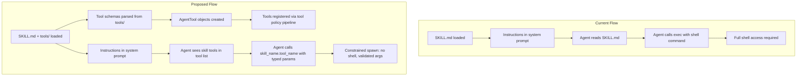

# Skill-Provided Tools: Eliminating the exec Blast Radius

## The Problem

Today, skills are **prompt instructions**. The lifecycle is:

1. Skill list (name + description + path) injected into system prompt
2. Agent reads `SKILL.md` via the `read` tool
3. Agent follows instructions, which often say "run `scripts/foo.py <args>`"
4. Agent calls `exec` with a shell command
5. **This requires `group:runtime` (exec) access** -- full shell on the host

The blast radius is enormous: a skill that only needs `imagemagick convert` gets the same power as `rm -rf /`. The exec-approvals system (`[src/infra/exec-approvals.ts](src/infra/exec-approvals.ts)`) and the skill security scanner (`[src/security/skill-scanner.ts](src/security/skill-scanner.ts)`) are mitigations, not solutions.

## The Proposal: Skills as Tool Providers

**Mental model shift:**

- FROM: Skills = "instructions that require generic tool access"
- TO: Skills = "capability providers that expose specific, typed tools"

This is **not** a wholesale replacement. Skills remain skills (instructions + context), but gain the ability to **declare tools** with structured schemas. The agent calls these tools directly instead of shelling out.

## Architecture




## Feasibility: Yes, Strongly

The existing infrastructure already supports this pattern:

- **Plugin tools** (`[src/plugins/types.ts](src/plugins/types.ts)`, `[src/plugins/registry.ts](src/plugins/registry.ts)`) already register custom `AgentTool` objects with TypeBox schemas via `api.registerTool()`. Skill tools would use the same `AgentTool` interface.
- **Tool policy pipeline** (`[src/agents/tool-policy-pipeline.ts](src/agents/tool-policy-pipeline.ts)`) already filters tools through multi-layer allow/deny policies. Skill tools slot in naturally.
- **Skill command dispatch** (`[src/agents/skills/types.ts](src/agents/skills/types.ts)` `SkillCommandDispatchSpec`) already has a `kind: "tool"` concept mapping skill commands to tool names -- this is a seed of the idea.
- **TypeBox schemas** are already the standard for tool parameter definitions.
- **Exec approvals** and sandbox infrastructure can be reused for the constrained executor.

## Design: Declarative Schema + Constrained Executor

### Tool Definition Format

Each skill can include a `tools/` directory with YAML/JSON tool definitions:

```
my-skill/
  SKILL.md
  tools/
    convert_image.yaml    # schema + metadata
  scripts/
    convert_image.py      # implementation
```

`tools/convert_image.yaml`:

```yaml
name: convert_image
description: Convert an image between formats using ImageMagick
executable: python3 scripts/convert_image.py
parameters:
  input_path:
    type: string
    description: Path to the source image
  output_format:
    type: string
    description: Target format (png, jpg, webp, etc.)
    enum: [png, jpg, webp, gif, tiff]
  quality:
    type: number
    description: Output quality (1-100)
    optional: true
```

The agent sees this tool as `skill:my_skill:convert_image` in its tool list. Policy can target it via `skill:my_skill:*` or `group:skill-tools`.

### Execution Model

Unlike `exec` (which interprets a shell command string), skill tools use **constrained spawn**:

1. **Schema validation**: Parameters validated against the declared JSON Schema before execution
2. **Direct spawn**: `child_process.spawn(interpreter, [scriptPath], { stdio: 'pipe' })` -- no shell
3. **Structured I/O**: Validated params sent as JSON on stdin; result read from stdout
4. **No PATH manipulation**: Script path is resolved relative to the skill directory only
5. **No env injection**: Only explicitly declared env vars are passed through
6. **Optional sandbox**: Can run inside Docker sandbox if `sandbox.mode` is enabled

### Integration Points

- **Skill loader** (`[src/agents/skills/workspace.ts](src/agents/skills/workspace.ts)`): Extended to parse `tools/` directory and create `AgentTool` wrappers
- **Tool registration**: Skill tools registered through the same pipeline as plugin tools, under a `group:skill-tools` group
- **Tool policy**: New tool group `group:skill-tools` allows enabling skill tools without enabling `exec`. Config example: `tools.allow: ["group:skill-tools"]`
- **System prompt**: Skill tools appear in the agent's tool list automatically (no prompt instructions needed for execution)
- **Security scanner** (`[src/security/skill-scanner.ts](src/security/skill-scanner.ts)`): Extended to validate tool definitions (schema correctness, script path safety)

### Security Properties


| Property             | Current (exec)           | Proposed (skill tools)            |
| -------------------- | ------------------------ | --------------------------------- |
| Shell interpretation | Yes                      | No (direct spawn)                 |
| Arbitrary commands   | Yes                      | No (only declared scripts)        |
| Parameter validation | None                     | JSON Schema enforced              |
| Blast radius         | Full shell               | Single script, typed args         |
| Auditability         | Command strings in logs  | Structured tool calls with params |
| Policy control       | exec allow/deny (binary) | Per-tool allow/deny               |


### Backward Compatibility

- Existing skills without `tools/` continue to work exactly as today
- Skills can mix instructions + tools (e.g., guidance in SKILL.md + tools for actions)
- Gradual migration: skills can be updated to use tools incrementally
- `exec` remains available for skills that genuinely need shell access (power-user escape hatch)

## Do We Need a Different Mental Model?

**Partially, but it's an evolution, not a revolution.**

The shift is from "skills tell the agent what to do" to "skills give the agent capabilities." But both can coexist:

- **Instructions** (SKILL.md body): Guidance, context, decision-making heuristics
- **Tools** (tools/ directory): Structured, typed, constrained actions

This is analogous to how MCP servers provide both **prompts** (context) and **tools** (actions). Skills evolve to be lightweight, declarative MCP-like providers without the overhead of running a separate server process.

The key conceptual change: **skills stop being consumers of generic tools and start being providers of specific tools.**

## Relationship to the Agent Skills Specification

### Current State: OpenClaw Already Extends the Spec Extensively

The [Agent Skills spec](https://agentskills.io/specification) defines a minimal contract: SKILL.md with `name`/`description` frontmatter, optional directories (`scripts/`, `references/`, `assets/`), and an experimental `allowed-tools` field.

OpenClaw already goes well beyond this:

- `**metadata.openclaw` block**: `always`, `skillKey`, `primaryEnv`, `emoji`, `homepage`, `os`, `requires` (bins/env/config), `install` (brew/node/go/uv/download). None of this is in the spec.
- **Custom frontmatter fields**: `user-invocable`, `disable-model-invocation`, `command-dispatch`, `command-tool`, `command-arg-mode`. All OpenClaw-specific.
- **Skill command dispatch**: `command-dispatch: tool` already maps skills to named tools -- a seed of the tools-as-capabilities idea.
- **Install infrastructure**: Brew/npm/Go/uv/download auto-install is entirely an OpenClaw extension.

The docs describe OpenClaw as following the spec for "layout/intent" -- not strict compliance.

### Coupling to the Spec Library

The dependency on `@mariozechner/pi-coding-agent` is moderate and non-blocking:

- `loadSkillsFromDir()` only extracts `name`, `description`, `filePath`, `baseDir`, `source`. It ignores everything else.
- `formatSkillsForPrompt()` only uses spec-standard fields for prompt generation.
- OpenClaw **re-reads SKILL.md** with its own parser after the library loads it, extracting all custom fields into `SkillEntry`.
- `ParsedSkillFrontmatter = Record<string, string>` -- the parser preserves all unknown fields. Adding new fields changes nothing.

### The `allowed-tools` Field: Present but Unused

The spec's experimental `allowed-tools` field appears in some OpenClaw skills (e.g., `skills/discord/SKILL.md` has `allowed-tools: ["message"]`), but is **completely ignored at runtime**. It's parsed and preserved in frontmatter but never acted on. This field approaches the problem from the wrong direction -- "what generic tools does this skill need" vs. "what specific tools does this skill provide."

### Strategic Path: Extend Locally, Propose Upstream

**Path A (recommended): Local extension, spec-compatible.**
Add `tools/` as an OpenClaw extension directory. The spec explicitly allows optional directories and doesn't prescribe a closed set. A skill with `tools/` is still a valid Agent Skills skill -- other implementations would simply ignore the directory, just as they'd ignore `metadata.openclaw`. This is consistent with how OpenClaw already extends the spec for `requires`, `install`, `command-dispatch`, etc.

**Path B (future): Upstream spec proposal.**
If the pattern proves valuable, propose `provides-tools` (or evolution of `allowed-tools`) as a first-class spec concept. A working reference implementation in OpenClaw would be the strongest argument. The `allowed-tools` experimental flag shows the spec authors were already thinking about tool access.

**Path C (avoid): Wait for upstream.**
Getting spec changes through open governance is slow and uncertain. OpenClaw's existing extensions demonstrate that local extension is the practical approach. The spec is designed for this -- `metadata` is explicitly "arbitrary key-value mapping."

## Devil's Advocate: Is This Actually Needed?

### "Is exec in a sandbox safe enough?"

**Sandbox defaults to `"off"`** (`src/agents/sandbox/config.ts:166`). It's opt-in, requires Docker, and most users run without it. When sandbox IS enabled with strong defaults (`network: "none"`, `capDrop: ["ALL"]`, `readOnlyRoot: true`), it provides genuine isolation.

The value of skill-provided tools varies by context:

- **Without sandbox (the default/majority)**: Skill tools are a **critical** improvement -- the difference between full host shell and constrained execution.
- **With sandbox enabled**: Skill tools are **defense-in-depth** plus auditability -- structured calls with typed params vs. opaque shell commands. Exec inside the sandbox still runs `sh -lc <command>`, letting the agent run any command within the container.
- **For untrusted/third-party skills**: Skill tools matter even in a sandbox, because "any command in a container" is still too broad for code you didn't write.

**Verdict**: Sandbox is strong when enabled but most users don't enable it. Skill tools are most valuable for the default-off majority.

### "Don't skills need to be read-only for this to have any real effect?"

**Yes. This is a critical prerequisite.**

Currently, agents CAN modify skill files:

- Workspace skills (`<workspace>/skills/`, `<workspace>/.agents/skills/`) are inside the workspace root. The `workspaceOnly` filesystem guard restricts writes to the workspace but doesn't exclude `skills/` subdirectories.
- Even with sandbox + `workspaceAccess: "ro"`, skills are **copied** into the sandbox workspace via `syncSkillsToWorkspace` (`src/agents/skills/workspace.ts:349-407`), and that sandbox workspace is writable.
- Only bundled skills (shipped with install, outside workspace) are truly immutable.

**The attack**: An agent modifies the tool definition YAML or backing script, then calls the "constrained" tool. Schema validation becomes theater -- you're validating params against a schema the agent just rewrote.

**Required mitigation (prerequisite for skill tools to be a security boundary):**

The approach differs based on whether the agent is sandboxed:

**Sandboxed agents (Docker): Read-only bind mounts (kernel-enforced)**

The sandbox infrastructure already supports `:ro` bind mounts (`src/agents/sandbox/docker.ts:318-322`, `src/agents/sandbox/fs-paths.ts:26-53`). Instead of copying skills into the writable sandbox workspace (`syncSkillsToWorkspace` in `src/agents/sandbox/context.ts:48-59`), mount each skill directory read-only:

```
-v /home/user/.openclaw/skills/my-skill:/workspace/skills/my-skill:ro
-v /path/to/workspace/skills/pdf-tool:/workspace/skills/pdf-tool:ro
```

Docker handles overlapping mounts correctly -- even if `/workspace` is writable, `/workspace/skills/my-skill:ro` is genuinely read-only at the kernel level. This is the strongest guarantee: no JavaScript path checks, no hashing, just a filesystem mount the agent cannot circumvent.

This replaces the current copy-based sync (`fsp.cp` in `syncSkillsToWorkspace`) with bind mounts resolved before container creation. The infrastructure already exists; only `src/agents/sandbox/context.ts` needs to change.

**Non-sandboxed agents: Application-level write guard + hash verification**

Without Docker, enforcement must happen at the application level:

1. **Write-protect skill directories**: Extend `wrapToolWorkspaceRootGuard` in `src/agents/pi-tools.read.ts` to reject writes to recognized skill directory paths (`skills/`, `.agents/skills/`, managed/bundled skill paths).
2. **Load-time hashing**: Hash skill tool definitions and scripts at load time; verify hashes before execution. If the hash doesn't match, reject the tool call.

This is weaker than kernel-enforced read-only mounts (the agent could theoretically bypass OpenClaw's write guard via `exec` if it still has exec access), but combined with removing `exec` from the agent's tool set when skill tools are used, it creates a workable security boundary.

**The two-tier model**: Sandbox = kernel-enforced immutability. No sandbox = application-level guard + hash check. Both are necessary; the sandbox path is strictly stronger.

Without skill immutability, skill-provided tools are defense against accidents (still valuable for auditability and preventing unintentional misuse) but NOT a security boundary against a compromised or adversarial agent.

## Alternatives Considered

- **Skills as full plugins** (skills include `index.ts` with `registerTool()`): Too powerful -- running arbitrary TS in the skill loader is the same security problem. Plugins are for trusted first-party code.
- **WASM sandbox**: Ultimate isolation but very high implementation cost and limited ecosystem. Could be a future evolution of the constrained executor.
- `**allowed-tools` from Agent Skills spec**: Approaches the problem from the wrong direction -- it says "this skill needs these generic tools" rather than "this skill provides these specific tools."
- **Wait for spec change**: Impractical given OpenClaw already extends the spec in many ways. The extension pattern is established and non-breaking.

## Resolved Design Decisions

- **Interpreter/executable**: Declared explicitly in the tool definition YAML. The `executable` field specifies what to run -- an interpreter + script path, a binary the skill ships, or a system binary. No magic discovery. Examples:
  - `executable: python3 scripts/convert_image.py` (interpreter + script)
  - `executable: scripts/my-binary` (skill-supplied binary, resolved relative to skill dir)
  - `executable: imagemagick convert` (system binary -- requires `requires.bins` gate)
- **Streaming output**: Not required. OpenClaw tools return a complete `AgentToolResult` to the LLM. The `onUpdate` callback in the tool execute signature is for internal progress updates, not LLM-facing streaming. LLMs work on tool call -> complete output. Skill tools follow the same pattern.
- **Tool naming**: Namespaced. Format: `skill:<skill_name>:<tool_name>` (e.g., `skill:image_processor:convert_image`). This is required because:
  - The `tools.allow` / `tools.deny` policy in config needs to distinguish skill tools from each other and from core/plugin tools.
  - Prevents collisions between skills that might define tools with the same name.
  - Enables glob patterns in policy: `skill:`* (all skill tools), `skill:image_processor:`* (all tools from one skill).
  - The `group:skill-tools` shorthand expands to all registered skill tools.
- **Sandboxing**: Follows the existing agent sandboxing model. Skill tool execution respects whatever sandbox policy is already configured for the agent (`sandbox.mode`, Docker, etc.). This is not a skill-specific concern -- it's the chosen security model for the agent. The constrained executor spawns processes through the same host resolution logic as other tools.

## Open Questions

- **Upstream proposal timing**: When (if ever) to propose `provides-tools` as a spec addition. Likely after OpenClaw has real-world usage data.
