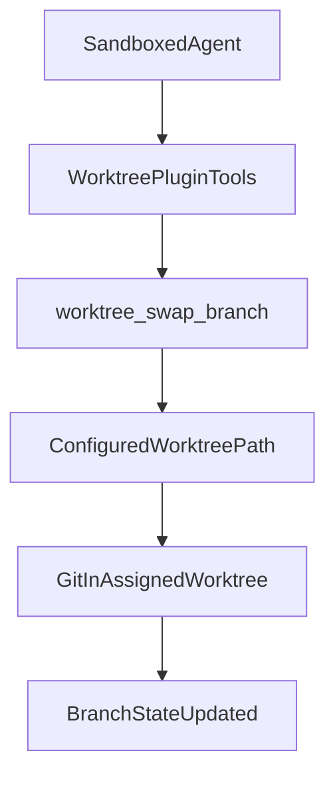

# Git Worktree Extension Plan (Extension-Only, Swap-Only)

## What We’re Building

Create a new plugin extension that exposes a single safe swap operation for sandboxed agents, without modifying core OpenClaw runtime files. v1 supports branch swapping within an assigned worktree only; no read-only helper tools and no worktree add/remove/prune.

Scope boundary:

- Tool handles branch-state transitions in an assigned worktree and optional push checks.
- Tool does not manage commit authorship, commit creation policy, merge orchestration, or PR merge strategy.
- Assume normal downstream mergeability checks happen outside this tool.
- Caller is expected to run normal `git push` from the assigned worktree after commits; this is standard git behavior and remains outside swap-tool responsibility.

## Prerequisites To Document First

- Fixed mount contract for each sandboxed agent container using canonical absolute paths (example root: `/home/openclaw/.openclaw`):
  - bare repo: `/home/openclaw/.openclaw/repos/<repo>.git`
  - per-agent assigned worktree: `/home/openclaw/.openclaw/worktrees/<agent-id>`
- Path consistency rules are strict for worktree internals: host and container paths for mounted bare repo/worktree must be identical absolute paths.
- Sandbox config must mount the assigned worktree + bare repo paths into the container. `agents.*.sandbox.docker.workdir` may point there for convenience, but is not required.
- No GitHub API dependency for core swap/prune behavior in this tool; operations are git-local against the assigned worktree + bare repo.
- Branch naming ownership/governance is outside this tool; caller/orchestrator chooses branch names.

## Moving Parts and File Targets

- New extension package scaffold:
  - [extensions/git-worktree/openclaw.plugin.json](extensions/git-worktree/openclaw.plugin.json)
  - [extensions/git-worktree/package.json](extensions/git-worktree/package.json)
  - [extensions/git-worktree/index.ts](extensions/git-worktree/index.ts)
  - [extensions/git-worktree/README.md](extensions/git-worktree/README.md)
- Reference patterns for plugin registration and tool wiring:
  - [docs/plugins/agent-tools.md](docs/plugins/agent-tools.md)
  - [docs/tools/plugin.md](docs/tools/plugin.md)
  - [src/plugins/tools.ts](src/plugins/tools.ts)
- Sandbox/runtime behavior references to align with:
  - [docs/gateway/sandboxing.md](docs/gateway/sandboxing.md)
  - [src/agents/bash-tools.exec.ts](src/agents/bash-tools.exec.ts)
  - [src/agents/sandbox/context.ts](src/agents/sandbox/context.ts)
  - [src/config/types.sandbox.ts](src/config/types.sandbox.ts)
  - [src/config/zod-schema.agent-runtime.ts](src/config/zod-schema.agent-runtime.ts)

## Concrete Disk Layout and Mapping

- Canonical host layout (example):
  - `/home/openclaw/.openclaw/repos/openclaw.git` (bare repo)
  - `/home/openclaw/.openclaw/worktrees/agent-1` (agent-1 assigned worktree)
  - `/home/openclaw/.openclaw/worktrees/agent-2` (agent-2 assigned worktree)
- Required bind behavior:
  - Each agent container gets only its assigned-worktree path and bare repo path.
  - Bind targets in container use the same absolute paths as host.
- Agent sandbox config mapping (per agent):
  - `sandbox.workspaceAccess`: keep minimal (`none` or `ro`) unless broader access is intentionally required.
  - `sandbox.docker.workdir`: optional convenience; tool uses configured `worktreePath` directly via `git -C`.
  - `sandbox.docker.binds`: include exact absolute POSIX bind strings for assigned worktree + bare repo.
  - Container `rw` requirements are execution-location dependent:
    - if git writes run on host (this tool), host paths need `rw`; container can remain `ro` for bare repo.
    - if agent runs git write operations in container (`commit`/`push`), bare repo must be `rw` there as well.
- Tool config mapping:
  - Extension config stores per-agent assignments plus shared defaults:
    - `assignments.<agentId>.worktreePath`
    - `assignments.<agentId>.bareRepoPath`
    - `allowedBaseRefs`
  - Tool validates runtime paths against config before any git command.

Example agent mapping (illustrative, proposed extension config keys):

```yaml
agents:
  list:
    - id: agent-1
      sandbox:
        mode: all
        workspaceAccess: none
        docker:
          workdir: /home/openclaw/.openclaw/worktrees/agent-1
          binds:
            - /home/openclaw/.openclaw/worktrees/agent-1:/home/openclaw/.openclaw/worktrees/agent-1:rw
            - /home/openclaw/.openclaw/repos/openclaw.git:/home/openclaw/.openclaw/repos/openclaw.git:rw
plugins:
  config:
    git-worktree:
      assignments:
        agent-1:
          worktreePath: /home/openclaw/.openclaw/worktrees/agent-1
          bareRepoPath: /home/openclaw/.openclaw/repos/openclaw.git
      allowedBaseRefs: [origin/main]
```

Note:

- `assignments.<agentId>.worktreePath`, `assignments.<agentId>.bareRepoPath`, and `allowedBaseRefs` are proposed keys for the new `git-worktree` plugin schema in this plan.
- They are not existing built-in OpenClaw config keys today.

## Single-Agent Atomic Branch-Change Model

Assumption for this mode:

- One bare repo on host.
- One persistent worktree for one agent.
- Same absolute paths mounted into the container.

Concrete mapping:

- Bare repo (host and container): `/home/openclaw/.openclaw/repos/openclaw.git`
- Agent worktree (host and container): `/home/openclaw/.openclaw/worktrees/agent-1`
- Agent sandbox workdir: arbitrary (tool still targets configured `worktreePath` via `git -C`).

Atomic requirement in this model:

- The current worktree is never removed.
- Branch switch is treated as a single critical mutation: old branch remains active unless switch command succeeds.
- Failure must not detach HEAD, remove worktree, or replace filesystem path.
- Primary flow is to switch to a target branch, creating it from base ref only when missing.

Critical commands for branch change:

- Existing branch path: `git -C /home/openclaw/.openclaw/worktrees/agent-1 checkout <targetBranch>`
- Create-if-missing path: `git -C /home/openclaw/.openclaw/worktrees/agent-1 checkout -b <targetBranch> <baseRef>`

Interpretation:

- On success: worktree HEAD is now `<targetBranch>`.
- On failure: worktree HEAD remains previous branch.
- No `worktree remove/add` allowed in this mode.
- No force-reset behavior (`checkout -B`) in v1.

## Tool Surface To Expose (v1)

- `worktree_swap_branch` (single mutating tool)
  - Purpose: provide one audited, policy-validated swap primitive that avoids giving sandboxed agents broad host-level git control.
  - In-place switch semantics:
    - switch to existing `targetBranch`, or
    - create `targetBranch` from `baseRef` when missing (default `baseRef=origin/main`).
  - Preflight checks: caller identity/ownership validation, assignment existence validation, path binding validation, mandatory clean-tree guard, explicit upstream/ahead guards with ignore flags, branch name validity via git, allowed base-ref validation.
  - Explicitly rejects `git worktree add/remove/prune` operations.

## Caller Intent and Ownership Validation

Configuration authority rule:

- Topology decisions (repo/worktree paths, assignment ownership, prune cadence) are configuration choices made by the OpenClaw operator.
- The tool must not infer alternative topology from ambient filesystem layout.
- Runtime checks verify configured intent; they do not replace config as the source of truth.

How we know what the request means:

- Tool input is minimal and declarative:
  - `targetBranch` (required)
  - `baseRef` (optional, default `origin/main`)
  - `branchMode` (optional enum: `auto` | `create` | `existing`, default `auto`)
  - `ignoreUnpushed` (optional boolean, default `false`)
  - `ignoreNoUpstream` (optional boolean, default `false`)
- Tool does not accept arbitrary filesystem paths from caller.
- Semantics are fixed: "switch assigned worktree to target branch; create from baseRef only when needed."

How we know the call is valid for this agent:

- Resolve caller identity from runtime context:
  - primary: plugin tool context `agentId`
  - fallback: derive from `sessionKey` if available
  - if unresolved: fail `CALLER_ID_MISSING`
- Resolve assigned worktree from plugin config (single-agent can be explicit default):
  - `plugins.config.git-worktree.assignments.<agentId>.worktreePath`
  - `plugins.config.git-worktree.assignments.<agentId>.bareRepoPath`
  - if no assignment: fail `AGENT_WORKTREE_UNASSIGNED`
- Validate that assigned worktree is an actual linked worktree for expected bare repo:
  - `git -C <worktreePath> rev-parse --git-common-dir`
  - compare normalized result to configured `<bareRepoPath>`
  - optionally cross-check: `git -C <bareRepoPath> worktree list --porcelain` contains `<worktreePath>`
  - mismatch/missing: fail `AGENT_WORKTREE_INVALID`

## Command Contract (Document + Implement)

- Swap workflow only (no status/list tool APIs in v1):
  - Safe swap in `auto` mode:
    - if target branch exists: `git -C <worktreePath> checkout <targetBranch>`
    - otherwise: `git -C <worktreePath> checkout -b <targetBranch> <baseRef>`
  - Verify: `git -C <worktreePath> rev-parse --abbrev-ref HEAD`
- Failure handling:
  - Non-clean tree behavior documented (reject by default with actionable message).
  - Unpushed local commit behavior documented (reject by default with actionable message).
  - Checkout/verification outcomes surfaced back as structured errors.

## Exact Safe-Swap Steps Exposed To Agent

`worktree_swap_branch` provides one atomic flow in caller's assigned worktree (no add/remove/prune in v1):

1. Resolve configured worktree path and bare repo path from extension config (`<worktreePath>`, `<bareRepoPath>`).
2. Validate that both are absolute POSIX paths and match expected mounted layout.
3. Validate path-consistency rule: configured container-visible paths must equal host canonical paths for worktree metadata safety.
4. Validate `targetBranch` is non-empty and passes git branch naming rules (`git check-ref-format --branch`).
5. Validate `baseRef` against allowlist (default allow `origin/main` only).
6. Resolve caller (`agentId`) and assignment (`worktreePath`, `bareRepoPath`); fail if caller has no assigned worktree.
7. Validate assigned worktree linkage to configured bare repo.
8. Read current state:
  - `git -C <worktreePath> rev-parse --abbrev-ref HEAD`
  - `git -C <worktreePath> status --porcelain --branch`
9. Enforce clean-tree gate (mandatory): if porcelain output has file changes, fail with instructions to commit/push/stash first.
10. Enforce pushed-state gate with explicit overrides and control flow:
  - resolve upstream with `git -C <worktreePath> rev-parse --abbrev-ref --symbolic-full-name @{upstream}`
  - if upstream missing:
    - if `ignoreNoUpstream=false`, fail `NO_UPSTREAM`
    - if `ignoreNoUpstream=true`, skip ahead/behind computation and continue
  - if upstream present:
    - compute ahead/behind with `git -C <worktreePath> rev-list --left-right --count @{upstream}...HEAD`
    - if ahead>0 and `ignoreUnpushed=false`, fail `UNPUSHED_COMMITS`
    - if ahead>0 and `ignoreUnpushed=true`, continue with warning
    - if ahead==0, continue
11. Base ref freshness note: tool does not fetch; freshness of `<baseRef>` (for example `origin/main`) depends on external orchestrator/scheduler fetch cadence.
12. Perform in-place swap according to `branchMode`:
  - `existing`: require target exists, then `git -C <worktreePath> checkout <targetBranch>`
  - `create`: require target missing, then `git -C <worktreePath> checkout -b <targetBranch> <baseRef>`
  - `auto` (default): try existing-path first; if missing, run create-path.
  - No `checkout -B` reset behavior in any mode.
13. Verify result:
  - `git -C <worktreePath> rev-parse --abbrev-ref HEAD`
  - `git -C <worktreePath> rev-parse HEAD`
14. Return structured response with:
  - previous branch
  - new branch
  - new HEAD SHA
  - any warnings
  - caller agentId and resolved worktree path
  - `ignoreUnpushedApplied` (boolean)
  - `ignoreNoUpstreamApplied` (boolean)
  - warnings when ignore flags were used to bypass a guard

Dirty-state failure contract:

- If uncommitted changes exist, tool returns `DIRTY_WORKTREE` and performs no branch mutation.
- This is a hard-stop error, not a hint.
- Safe recovery expectation is external to this tool: caller must explicitly choose commit/stash/reset via separate operations before retrying swap.
- Tool must not chain or suggest destructive remediation automatically.

Precheck race clarification:

- Prechecks are: dirty tree check, upstream/ahead check, and branch-name/base-ref validation before checkout.
- Git ref/branch mutation itself is protected by git's lockfiles.
- Therefore, concurrent calls can cause one caller to fail cleanly (for example branch now exists), but should not corrupt repo state.
- v1 does not require an application lock for correctness; per-assignment lock is optional UX hardening to reduce noisy duplicate failures.

Atomicity contract:

- The tool must not remove/destroy the current slot/worktree before branch creation succeeds.
- If swap fails (invalid branch name, missing base ref, missing required branch, create conflict, checkout failure), current branch/worktree state remains unchanged.
- Because v1 uses in-place checkout/create (`checkout` or `checkout -b`) and forbids remove/add, failure leaves prior state intact by design.
- Optional hardening: use a per-assignment lock file to serialize concurrent swap attempts from duplicated tool calls.

### Why v1 Uses In-Place Swap Only

- The source document describes teardown/recreate safety details (`cd /tmp`, `worktree remove`, `worktree add`) for full lifecycle swaps.
- In v1 we intentionally do not expose those commands to sandboxed agents.
- The tool contract uses `checkout` and `checkout -b` only, which avoids destructive reset/remove/add behavior and removes the `cd /tmp`/remove/add sharp edges for agents.
- Atomicity scope in v1: protect existing slot/worktree from destructive remove/add flows; branch-swap failures must leave current checked-out branch intact.

### Structured Error Cases

- `CALLER_ID_MISSING`: runtime context did not provide a resolvable agent identity.
- `AGENT_WORKTREE_UNASSIGNED`: caller agent has no configured assigned-worktree/bare-repo mapping.
- `AGENT_WORKTREE_INVALID`: assigned worktree is missing or not linked to configured bare repo.
- `DIRTY_WORKTREE`: local changes detected; no branch switch attempted.
- `UNPUSHED_COMMITS`: local branch is ahead of upstream and `ignoreUnpushed=false`; no branch switch attempted.
- `NO_UPSTREAM`: current branch has no upstream tracking ref and `ignoreNoUpstream=false`; no branch switch attempted.
- `INVALID_BRANCH_NAME`: branch is invalid per git branch naming rules.
- `BASE_REF_NOT_FOUND`: requested `baseRef` is missing.
- `BRANCH_ALREADY_EXISTS`: `branchMode=create` requested a branch that already exists.
- `BRANCH_NOT_FOUND`: `branchMode=existing` requested a branch that does not exist.
- `CHECKOUT_FAILED`: git checkout returned non-zero.
- `VERIFY_FAILED`: post-checkout branch/sha verification mismatch.

Failure precedence and short-circuiting:

1. Assignment/identity/input errors before repository-state errors.
2. `DIRTY_WORKTREE` is returned before upstream/ahead checks.
3. `NO_UPSTREAM` short-circuits ahead/behind computation unless `ignoreNoUpstream=true`.
4. `UNPUSHED_COMMITS` evaluated only when upstream exists and ahead>0.
5. In `branchMode=auto`, if target does not exist and create path is selected, missing `baseRef` returns `BASE_REF_NOT_FOUND`.

## Guardrails

- Enforce that operations run only inside configured assigned-worktree root (`<worktreePath>`), never arbitrary caller-provided paths.
- Enforce path-consistency rule for worktrees (no host/container absolute path drift for mounted worktree/bare-repo paths).
- Reject branch names that violate policy or are empty/unsafe.
- No deletion/removal commands in v1.
- Do not expose `worktree_get_status`/`worktree_list_slots`; agents can run status/read commands directly when permitted.
- Tool docs include explicit “not supported in v1” section for add/remove/prune and read-only helper duplication.
- Error responses must be conservative and bounded: no auto-fix side effects, no implied permission to rewrite history, and explicit “no change applied” on hard-stop validation failures.

## Branch Ref Lifecycle and Pruning

Observation:

- Swap-by-branch-creation leaves prior task branches (for example `feat/task-1`) in the bare repo.
- These refs accumulate as agents cycle tasks and must be cleaned up periodically.

Policy:

- Branch cleanup is an operator/orchestrator maintenance concern, not part of core swap success semantics.
- Keep swap tool non-destructive to preserve atomicity and auditability.
- Add a periodic branch-prune routine (scheduled job or explicit admin command) with conservative safety checks.
- v1 scope: prune is external maintenance only (scheduled/orchestrator path).
- Optional v1.1 behavior: opportunistic best-effort prune can run after successful swap on cadence (swap #1, then every 10th swap per agent/assignment).
- If v1.1 is enabled, opportunistic prune is post-swap side effect only: it never blocks or fails the caller-visible swap result.
- Fetch ownership is external to the swap tool: orchestrator/scheduler updates bare-repo refs; swap tool does not call `git fetch`.

Recommended prune gates:

1. Only consider branches matching configured ephemeral prefixes/patterns.
2. Never prune branches younger than configured minimum age (for example 7 days).
3. Never prune branches that still have a matching remote-tracking branch (for example `refs/remotes/origin/<branch>` exists after scheduled fetch).
4. Only prune branches already merged into `origin/main` (or configured integration branch).
5. Never prune currently checked-out worktree branches (`git worktree list --porcelain` guard).
6. Support dry-run mode by default for visibility.

Suggested commands for maintenance path:

- enumerate candidate ephemeral branches:
  - `git -C <bareRepoPath> for-each-ref refs/heads/<ephemeral-prefix>* --format='%(refname:short) %(committerdate:unix)'`
- filter by age threshold:
  - compare `%(committerdate:unix)` with configured cutoff timestamp
- require fresh remote refs before prune evaluation:
  - orchestrator performs scheduled `git -C <bareRepoPath> fetch --prune origin`
- check remote branch existence (protect branches still present on remote):
  - `git -C <bareRepoPath> show-ref --verify --quiet refs/remotes/origin/<branch>`
- enumerate merged ephemeral branches:
  - `git -C <bareRepoPath> branch --merged origin/main`
- enumerate active worktree branches:
  - `git -C <bareRepoPath> worktree list --porcelain`
- delete eligible locals:
  - `git -C <bareRepoPath> branch -d <branch>`
- optional stale-metadata maintenance:
  - `git -C <bareRepoPath> worktree prune`

Opportunistic cadence semantics (if enabled):

1. Execute swap fully first and return success/failure based only on swap path.
2. If swap succeeded, increment per-assignment counter in extension state.
3. Trigger prune when counter is `1` or `counter % 10 == 0`.
4. Run prune routine in best-effort mode:
  - no-op if nothing eligible
  - log diagnostics internally
  - do not surface prune errors as tool failure
  - skip deletion for branches that fail age/remote-exists/merged/activity gates

## Practical Implementation Details

### Unit Testing Strategy

- Tests for this extension must be hermetic: no real git binary/process calls.
- Table-driven tests for swap decision logic:
  - `branchMode=existing|create|auto`
  - branch exists/missing combinations
  - dirty/unpushed/no-upstream gate outcomes
- Mock process executor for deterministic command outcomes:
  - exit code
  - stdout
  - stderr
- Golden-style assertions for structured result payloads:
  - `noChangeApplied`
  - error code
  - branch before/after
  - warnings list
- Negative tests for command safety:
  - no shell interpolation paths
  - no accidental `checkout -B`, `reset --hard`, `clean -fdx`, `worktree remove/add`
  - no real process spawning during tests

### Git Process Calling

- Use a single internal process wrapper for all git invocations in this plugin.
- Execute with argv arrays (no shell concatenation) and explicit cwd/timeout.
- Standard command shape:
  - `["git", "-C", "<worktreePath>", ...args]`
- For bare-repo operations:
  - `["git", "-C", "<bareRepoPath>", ...args]`
- Categorize process outcomes:
  - success (`exitCode=0`)
  - expected hard-stop validation failure (mapped to structured tool errors)
  - unexpected execution failure (mapped to internal error class)

### Stdout/Stderr Logging Policy

- Do not stream raw subprocess logs back to agent by default.
- Capture stdout/stderr for each git call internally and attach only bounded excerpts in error responses when useful.
- Always include structured fields first (`errorCode`, `noChangeApplied`, `actionRequired`); logs are secondary diagnostics.
- Redact sensitive strings if present in command output before returning diagnostics.
- Keep full raw command logs in host diagnostics only (not agent context payloads) to avoid context bloat and unsafe leakage.

### Command Usage and Arg Passing Rules

- Allowlist git subcommands used by the tool:
  - `rev-parse`, `status`, `check-ref-format`, `checkout`, `rev-list`, `show-ref`, `worktree list`, `branch --merged`, `branch -d`, `for-each-ref`
- Build args from typed values only; reject empty/invalid `targetBranch`, `baseRef`, paths before command execution.
- Never pass user input into a shell string.
- Enforce strict separation of intent vs execution:
  - decide command plan from validated state
  - execute exactly one planned command path for swap
  - verify post-state with read-only git commands

## Configuration Failure Model

Two-stage failure policy:

1. Load-time/config-time failures (plugin should not load):
  - invalid plugin config schema shape/types
  - missing required plugin config keys
  - invalid enum/format values enforced by config schema
2. Invocation-time/runtime failures (tool loads, call fails safely):
  - caller has no assignment (`AGENT_WORKTREE_UNASSIGNED`)
  - assignment points to missing/invalid/unlinked worktree (`AGENT_WORKTREE_INVALID`)
  - runtime guard failures (`DIRTY_WORKTREE`, `UNPUSHED_COMMITS`, `NO_UPSTREAM`, etc.)

Response contract for invocation-time hard-stop failures:

- `noChangeApplied: true`
- structured `errorCode`
- objective-neutral reason text
- no automatic remediation or history-rewrite suggestions

## Verification Plan

- Unit tests for command builder/validation in extension.
- Hermetic behavior tests (mocked executor only) for:
  - missing `agentId` context (expected rejection)
  - assigned worktree missing/invalid (expected rejection)
  - assigned worktree not linked to configured bare repo (expected rejection)
  - swap to new branch
  - swap when dirty (expected rejection)
  - swap when unpushed commits exist (expected rejection)
  - swap when no upstream exists (expected rejection)
  - swap target branch already exists (expected rejection)
  - swap target branch missing in `existing` mode (expected rejection)
  - swap to existing branch in `auto` mode (expected success)
  - swap to new branch in `auto` mode (expected success)
  - two concurrent swap calls: one succeeds, one fails cleanly, repo state remains valid
  - mismatch path config rejection (host/container path drift guard)
  - failed swap preserves current branch and worktree state (atomicity check)
  - opportunistic prune cadence fires on first and every tenth successful swap
  - prune no-op and prune failure do not change successful swap result
- Add a test guard that fails if the real process runner is invoked from extension tests.
- Run repo checks relevant to touched files (`pnpm test` target for extension, then `pnpm check`).

## Architecture Sketch




## End-to-End Usage (Single Agent)

1. Agent calls `worktree_swap_branch(targetBranch=feat/task-1, baseRef=origin/main, branchMode=auto)`.
2. Agent edits, commits, and pushes from assigned worktree.
3. PR is opened/reviewed/merged by external workflow.
4. Agent calls `worktree_swap_branch(targetBranch=feat/task-2, baseRef=origin/main, branchMode=auto)` to start next task on fresh branch state.

## Deliverables

- Extension package under `extensions/git-worktree` with `worktree_swap_branch` only.
- Operator-facing README covering prerequisites, mounts, required env vars, and allowed commands.
- Minimal test coverage for path validation + swap flow + clear structured failure messages.
